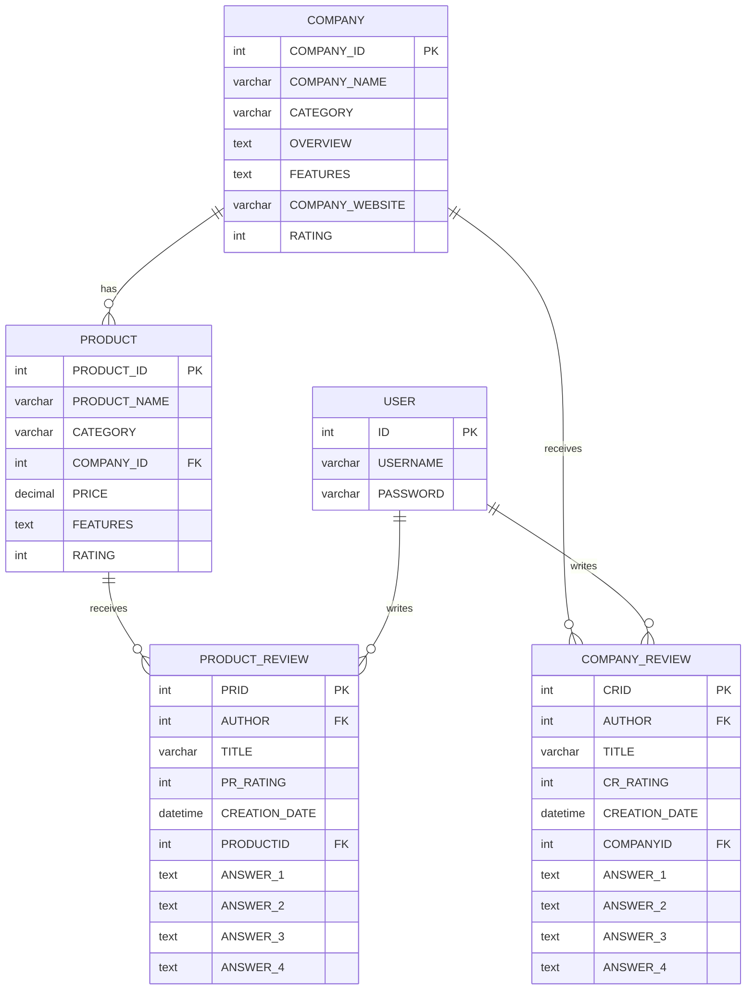

## Database Schema

```mermaid
erDiagram
    COMPANY {
        int COMPANY_ID PK
        varchar COMPANY_NAME
        varchar CATEGORY
        text OVERVIEW
        text FEATURES
        varchar COMPANY_WEBSITE
        int RATING
    }
    PRODUCT {
        int PRODUCT_ID PK
        varchar PRODUCT_NAME
        varchar CATEGORY
        int COMPANY_ID FK
        decimal PRICE
        text FEATURES
        int RATING
    }
    COMPANY_REVIEW {
        int CRID PK
        int AUTHOR FK
        varchar TITLE
        int CR_RATING
        datetime CREATION_DATE
        int COMPANYID FK
        text ANSWER_1
        text ANSWER_2
        text ANSWER_3
        text ANSWER_4
    }
    PRODUCT_REVIEW {
        int PRID PK
        int AUTHOR FK
        varchar TITLE
        int PR_RATING
        datetime CREATION_DATE
        int PRODUCTID FK
        text ANSWER_1
        text ANSWER_2
        text ANSWER_3
        text ANSWER_4
    }
    USER {
        int ID PK
        varchar USERNAME
        varchar PASSWORD
    }

    COMPANY ||--o{ PRODUCT : "has"
    COMPANY ||--o{ COMPANY_REVIEW : "receives"
    PRODUCT ||--o{ PRODUCT_REVIEW : "receives"
    USER ||--o{ COMPANY_REVIEW : "writes"
    USER ||--o{ PRODUCT_REVIEW : "writes"
```
